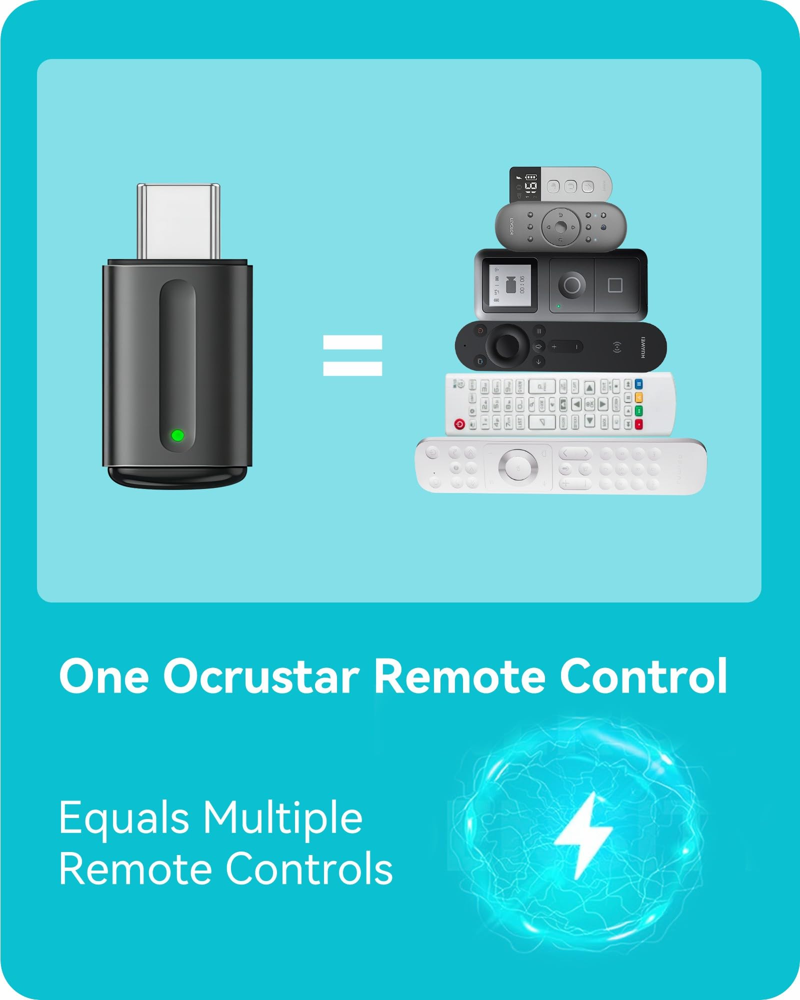

# Reverse Engineering the Ocrustar USB IR Blaster

**Complete protocol analysis and open-source driver for the Ocrustar Smart IR Blaster (VID `045C` / PID `02AA`)**

<p align="center">
  
  <br>
  <em>The Ocrustar USB IR Blaster — a $6 dongle that speaks a surprisingly complex protocol</em>
</p>

---

## Table of Contents

- [Background](#background)
- [The Hardware](#the-hardware)
- [Reverse Engineering Approach](#reverse-engineering-approach)
  - [Step 1: USB Descriptor Analysis](#step-1-usb-descriptor-analysis)
  - [Step 2: APK Decompilation](#step-2-apk-decompilation)
  - [Step 3: Native Library Analysis](#step-3-native-library-analysis)
  - [Step 4: Traffic Capture & Correlation](#step-4-traffic-capture--correlation)
- [Protocol Specification](#protocol-specification)
  - [USB Transport Layer](#usb-transport-layer)
  - [Handshake Sequence](#handshake-sequence)
  - [Device Identification](#device-identification)
  - [IR Transmission](#ir-transmission)
  - [IR Learning](#ir-learning)
  - [Serial Number Query](#serial-number-query)
- [The Encoding Pipeline](#the-encoding-pipeline)
  - [Stage 1: Pulse Compression (WAVZip)](#stage-1-pulse-compression-wavzip)
  - [Stage 2: LEB128 with ÷16 Prescaling](#stage-2-leb128-with-16-prescaling)
  - [Stage 3: Huffman Coding (D226 only)](#stage-3-huffman-coding-d226-only)
  - [Stage 4: Framing](#stage-4-framing)
- [The Gotchas](#the-gotchas)
- [APK Decompilation Deep Dive](#apk-decompilation-deep-dive)
  - [App Architecture](#app-architecture)
  - [Key Source Files](#key-source-files)
  - [VID/PID Whitelist](#vidpid-whitelist)
  - [Pre-Transmit Validation](#pre-transmit-validation)
  - [USB Host Manager Configuration](#usb-host-manager-configuration)
- [Cloud IR Database (Kookong SDK)](#cloud-ir-database-kookong-sdk)
  - [Kookong API Endpoints](#kookong-api-endpoints)
  - [ElkSmart Backend Endpoints](#elksmart-backend-endpoints)
  - [IR Data Format in Cloud](#ir-data-format-in-cloud)
  - [Kookong SDK Encryption](#kookong-sdk-encryption)
- [BLE Protocol](#ble-protocol)
- [The Three Bugs That Took 15 Versions to Fix](#the-three-bugs-that-took-15-versions-to-fix)
- [Working Code](#working-code)
- [Debugging & Troubleshooting](#debugging--troubleshooting)
- [Protocol Quick Reference](#protocol-quick-reference)
- [Related Work](#related-work)
- [Version History](#version-history)
- [License](#license)

---

## Background

The **Ocrustar Smart IR Blaster** is a tiny USB dongle sold on AliExpress and Amazon for around $6. Plug it into an Android phone (or a PC via USB-OTG), and it turns the device into a universal infrared remote control. The official app is called **Ocrustar** (package name `com.payne.okux`, built on the ElkSmart IR SDK `com.esmart.ir`).

These devices are rebranded variants of a design that appears under many names: ElkSmart, ZaZa Remote, Tiqiaa TView, ROCK IR, and others. They all share a common chipset and protocol family, but the specific encoding details differ between hardware revisions. The device covered here identifies as **D226** during handshake and uses a particularly interesting encoding pipeline that includes Huffman compression — making it more complex than the older D552 variant.

Despite being widely sold, there is **zero official documentation** for the USB protocol. The only way to control this device outside the vendor's Android app is to reverse-engineer the protocol from scratch. That's what this project documents.

### Why bother?

- **Home automation**: Send IR commands from a Raspberry Pi, server, or script
- **No phone dependency**: Control your TV/AC/soundbar from any computer
- **Batch operations**: Script complex IR macros (e.g., "turn everything off at midnight")
- **Preservation**: The Ocrustar app could disappear from the Play Store tomorrow — and it depends on Chinese cloud servers that may not last forever

---

## The Hardware

| Property | Value |
|---|---|
| USB VID | `0x045C` (Renesas/NEC — borrowed by device) |
| USB PID | `0x02AA` |
| USB Class | Vendor-specific (0xFF) |
| Endpoints | 1× Bulk IN (`0x81`), 1× Bulk OUT (`0x01`) |
| Max Packet Size | 64 bytes |
| Carrier Frequency | Configurable, typically 38 kHz |
| Form Factor | ~15 × 10 × 5 mm USB-A plug |
| Chipset | Unmarked SoC, ARM-based |
| Windows Device Name | `SMART` (Manufacturer: `SMTCTL`) |

The device presents as a standard USB device with vendor-specific bulk endpoints. No HID interface, no standard IR class — everything is proprietary.

```
InstanceId   : USB\VID_045C&PID_02AA\5&33432EA&0&6
FriendlyName : SMART
Manufacturer : SMTCTL
Status       : OK
```

---

## Reverse Engineering Approach

The reverse engineering followed a layered strategy, working from the outside in.

### Step 1: USB Descriptor Analysis

The first step was simply plugging the device in and reading its USB descriptors with `lsusb -v` (Linux) and USBDeview (Windows).

```
Bus 001 Device 007: ID 045c:02aa
  bDeviceClass         0
  bDeviceSubClass      0
  Endpoint Descriptor:
    bEndpointAddress     0x01  EP 1 OUT
    bmAttributes         2        Bulk
    wMaxPacketSize       64
  Endpoint Descriptor:
    bEndpointAddress     0x81  EP 1 IN
    bmAttributes         2        Bulk
    wMaxPacketSize       64
```

Key observations: bulk endpoints (not interrupt/HID), 64-byte max packet, and the VID `045C` (which is actually registered to Renesas/NEC — the device borrows their VID). The PID `02AA` becomes significant later during handshake — the firmware actually echoes its own PID as an identity token.

### Step 2: APK Decompilation

The Ocrustar Android app (`com.payne.okux` v6.2.9) was decompiled using **JADX 1.5.1**. The app is a Java/Kotlin wrapper around the ElkSmart IR SDK (`com.esmart.ir`). The key findings:

**Java layer** — The `UsbHostManager` class manages USB communication. The code uses `CommunicationRunnable` for the auth state machine, with clear markers for each protocol phase. Debug log statements left in the code were incredibly helpful for confirming the command structure and parameter ordering before any traffic was captured.

**IROTG class** — The core IR encoding logic lives in `com.esmart.ir.IROTG`, which handles the WAVZip+Huffman transmit pipeline and the `~reverseBits(value)` byte mangling. The decompiled `a(byte)` method was the Rosetta Stone for understanding the mangling function.

**WAVZip encoder** — Found in `com.esmart.ir.otg.b`, this Kotlin file implements the pulse-pair dictionary compression. The comparator class `com.esmart.ir.otg.c` revealed the critical sorting behavior: pairs are sorted by total duration, not just frequency.

**Huffman encoder** — Spread across `b.a` through `b.f` in the HufMZip package. The `PriorityQueue<e>` usage in the tree builder was the key discovery that explained why Python's `heapq` produced wrong trees.

### Step 3: Native Library Analysis

The `libelksmart.so` / `libkksdk.so` (ARM, 32-bit) libraries were loaded into **Ghidra** for static analysis. The critical functions identified:

1. **Pulse compression** — A function that takes raw IR timing arrays and compresses them by extracting the two most frequent pulse pairs as dictionary entries
2. **LEB128 encoder** — Variable-length integer encoding, but with a critical twist: all values are divided by 16 before encoding (a prescaling step not documented anywhere)
3. **Huffman encoder** — A full Huffman tree builder using a priority queue, applied to the compressed pulse stream
4. **Byte mangling** — Every protocol byte is bit-reversed and inverted before transmission
5. **Checksum** — A specific checksum algorithm applied per 62-byte frame

The Kookong SDK native library (`libkksdk.so`) also contained the 16-byte encryption key `Kf9j8Si15EKM9h4u` used for API payload encryption, though the encryption algorithm itself is custom (not standard AES).

### Step 4: Traffic Capture & Correlation

With the protocol partially understood from static analysis, USB traffic was captured using **Wireshark** with the USBPcap plugin (Windows) and `usbmon` (Linux). Known IR signals (NEC protocol commands with predictable bit patterns) were sent through the app, and the resulting USB packets were correlated with the expected encoding output.

This step confirmed every encoding stage and revealed the exact frame format, including the frequency encoding and payload length fields.

**Setting up USBPcap on Windows:**

```powershell
# Install USBPcap from https://desowin.org/usbpcap/ and reboot
# Identify your USB root hub:
USBPcapCMD.exe
# Start capture (pick the hub with the SMART device):
USBPcapCMD.exe -d \\.\USBPcap1 -A -o capture.pcapng
# In another terminal, run the script:
python ocrustar.py --send-test
# Stop capture with Ctrl+C, open in Wireshark
# Useful filters: usb.transfer_type == 3 (bulk), usb.data_len > 0
```

---

## Protocol Specification

### USB Transport Layer

All communication uses bulk transfers on endpoint `0x01` (OUT, host→device) and `0x81` (IN, device→host). The maximum transfer size is 64 bytes.

Large payloads are fragmented into 63-byte frames: 62 bytes of data + 1 byte checksum. The final fragment can be shorter and omits the checksum.

### Handshake Sequence

Every session begins with a three-step handshake:

```
Host  →  Device:   FC FC FC FC          (4 bytes: "hello")
Device →  Host:    FC FC FC FC XX YY    (6 bytes: "hello + device type")
Host  →  Device:   FA FA FA FA          (4 bytes: "acknowledged")
```

The `XX YY` bytes in the device response identify the hardware variant:

| XX | YY | Device Type | Encoding |
|---|---|---|---|
| `0x02` | `0xAA` | D226 / D571 | Pulse compression + Huffman |
| `0x70` | `0x01` | D552 | Pulse compression only |

The D226 is the newer, more common variant. The D552 is an older revision that skips the Huffman stage.

**Important**: The handshake must complete within ~1 second. If the device doesn't respond to `FC FC FC FC` within 200ms, retry up to 3 times. A USB endpoint flush before the first attempt prevents stale data from confusing the handshake.

The `FA FA FA FA` acknowledgment is **mandatory**. Skipping it (as some third-party implementations do) leaves the device in an unready state where it accepts but ignores transmit commands.

### Device Identification

The handshake response bytes `XX YY` correspond to the USB PID (`02 AA` → `0x02AA`). This is not a coincidence — the firmware echoes its own PID as an identity token.

If the first 4 bytes of the response are `FA FA FA FA` instead of `FC FC FC FC`, bytes 4–5 contain firmware version data rather than device type.

### IR Transmission

After handshake, IR signals are sent as encoded payloads with a fixed header:

```
FF FF FF FF [freq_hi] [freq_mid] [freq_lo] [len_hi] [len_lo] [payload...]
```

- **`FF FF FF FF`** — Preamble (4 bytes)
- **Frequency** — 3 bytes, mangled, encoded as `(carrier_hz + 0x7FFFF)`, split across bytes as `[bits 15:8] [bits 23:16] [bits 7:0]`
- **Payload length** — 2 bytes, mangled, big-endian
- **Payload** — The encoded IR signal (see [Encoding Pipeline](#the-encoding-pipeline))

Each byte in the header (frequency and length fields) is **mangled**: bit-reversed then bitwise-inverted.

The device responds with `FF FF FF FF` on success (echoing the preamble as an ACK).

### IR Learning

Learning mode captures IR signals from physical remotes:

```
Host  →  Device:   FE FE FE FE          ("start learning")
Device →  Host:    FE FE FE FE [len_hi] [len_lo] [raw_data...]
Host  →  Device:   FD FD FD FD          ("stop learning")
```

The device responds when it detects an IR signal. The `len` field indicates the total byte count of raw data to follow. Data may arrive in multiple USB transfers — accumulate until `len` bytes are collected.

Raw data is decoded by:

1. For each byte `b` where `b < 0xFF`: timing value = `b × 16 + carry`
2. For each byte `b == 0xFF`: accumulate `carry += 0xFF0` (4080µs overflow marker)

This produces an array of timing values in microseconds (alternating mark/space). The carry mechanism allows encoding values larger than 4064µs (254 × 16).

### Serial Number Query

The device serial number can be retrieved with:

```
Host  →  Device:   FB FB FB FB
Device →  Host:    FB FB FB FB [serial_data...]
```

If the response is exactly 15 bytes, the serial is decoded as: 6 ASCII characters (bytes 4–9), followed by 3 integer values (bytes 10–12), 1 ASCII character (byte 13), and 1 integer (byte 14), concatenated into a string.

---

## The Encoding Pipeline

This is the core of the protocol and where most of the reverse engineering effort went. The pipeline transforms an array of raw IR timing values (in microseconds) into the compressed payload that the device expects.

```
Raw timings (µs)
       │
       ▼
┌─────────────────────┐
│  Pulse Compression   │  Dictionary encode top-2 pairs ("WAVZip")
└──────────┬──────────┘
           │
           ▼
┌─────────────────────┐
│  Huffman Encoding    │  D226 only (skipped for D552)
└──────────┬──────────┘
           │
           ▼
┌─────────────────────┐
│  Framing + Checksum  │  62-byte chunks, mangled header
└──────────┬──────────┘
           │
           ▼
     USB bulk writes (2ms interval)
```

### Stage 1: Pulse Compression (WAVZip)

The name "WAVZip" comes from the decompiled class name `com.esmart.ir.otg.b` (WAVZip.kt). IR signals are highly repetitive — a typical NEC command has ~34 pulse pairs, but only uses 2–3 distinct (mark, space) durations. The encoder exploits this:

1. **Count frequencies** — Tally how often each `(mark, space)` pair appears
2. **Extract top 2** — Take the two most frequent pairs
3. **Sort by duration** — The shorter pair becomes index `0x00`, the longer becomes `0x01` (sorted by sum of mark + space)
4. **Build dictionary header** — Emit the two reference pairs (LEB128 encoded)
5. **Encode signal** — Replace matching pairs with `0x00` or `0x01`; encode non-matching pairs inline

The output format:

```
[pair1_mark] [pair1_space] [pair0_mark] [pair0_space] FF FF FF [encoded_pulses...]
```

Note the **counter-intuitive ordering**: pair1 (index `0x01`, the longer pair) is emitted first in the header, followed by pair0 (index `0x00`, the shorter pair). The `FF FF FF` separator marks the end of the dictionary.

**Example** — NEC signal with 560µs/560µs (short) and 560µs/1690µs (long) pairs:

```
Dictionary: pair1=(560,1690), pair0=(560,560)
Header: LEB128(560) LEB128(1690) LEB128(560) LEB128(560) FF FF FF
Body: 00 00 00 ... 01 01 ... (0x00 for short pair, 0x01 for long pair)
```

### Stage 2: LEB128 with ÷16 Prescaling

Individual timing values are encoded using [LEB128](https://en.wikipedia.org/wiki/LEB128) (Little-Endian Base 128), a variable-length integer encoding. However, there is a **critical prescaling step** that is not obvious from the code alone:

```
encoded_value = LEB128( round(raw_microseconds / 16) )
```

Every timing value is **divided by 16** (with rounding) before LEB128 encoding. This prescaling is what maps microsecond-precision timings into the byte range the device expects. The device hardware internally operates on 16µs ticks, so the prescaling converts microseconds to device ticks. Without this step, the encoded values are 16× too large and the device silently rejects the payload.

The LEB128 encoding itself:

```python
def leb128_encode(value):
    result = []
    while True:
        byte = value & 0x7F
        value >>= 7
        if value:
            byte |= 0x80  # set continuation bit
        if (byte & 0xFF) == 0xFF:
            byte = 0xFE   # escape: 0xFF is reserved as separator
        result.append(byte)
        if not value:
            break
    return result
```

Special case: values ≤ 1 are emitted directly without prescaling (these are dictionary index bytes `0x00`/`0x01`, not timing values).

**Prescaling examples:**

| Raw (µs) | ÷16 (rounded) | LEB128 |
|---|---|---|
| 560 | 35 | `0x23` |
| 1690 | 106 | `0x6A` |
| 4500 | 281 | `0x99 0x02` |
| 9000 | 563 | `0xB3 0x04` |
| 40000 | 2500 | `0xC4 0x13` |

### Stage 3: Huffman Coding (D226 only)

The D226 variant adds a Huffman compression layer on top of the pulse-compressed data. This is the most complex part of the protocol.

**Tree construction:**

1. Count byte frequencies in the pulse-compressed stream
2. Build a Huffman tree using a **min-heap priority queue**
3. The priority queue must match `java.util.PriorityQueue` tie-breaking behavior exactly — the firmware was compiled from Java/JNI code that uses this class

**Serialization format:**

```
[symbol_count_hi] [symbol_count_lo]    — number of unique symbols (2 bytes)
[sym0] [weight0_hi] [weight0_lo]       — symbol and its FREQUENCY (3 bytes each)
[sym1] [weight1_hi] [weight1_lo]
...
[pad_bits]                              — number of padding bits in last byte (1 byte)
[huffman_bitstream...]                  — the compressed data
```

**Critical detail:** The symbol table stores **frequency counts** (from the original node weights), NOT Huffman code lengths. The device firmware uses these frequencies to reconstruct the identical Huffman tree for decoding. This is unusual — most Huffman implementations transmit code lengths or canonical codes. Symbols are sorted by value (ascending) in the serialization.

**Why this matters for compatibility**: If the Huffman tree doesn't match the firmware's expected tree exactly, decompression produces garbage. The tree shape depends on tie-breaking order in the priority queue, which is why the Java `PriorityQueue` emulation is essential.

### Stage 4: Framing

The final encoded payload (after Huffman) is wrapped into USB frames:

1. Prepend `FF FF FF FF` + mangled frequency (3 bytes) + mangled length (2 bytes)
2. Split into 62-byte chunks
3. For each full 62-byte chunk: append 1 checksum byte (total: 63 bytes per frame)
4. The last chunk (if shorter than 62 bytes) is sent as-is without a checksum

**Checksum algorithm:**

```python
def checksum(frame_62_bytes):
    s = sum(frame_62_bytes)
    raw = (s & 0xF0) | ((s >> 8) & 0x0F)
    return mangle(raw)
```

**Byte mangling** (used for frequency, length, and checksum):

```python
def mangle(byte):
    # Reverse bits, then invert
    reversed = 0
    for i in range(8):
        reversed = (reversed << 1) | (byte & 1)
        byte >>= 1
    return (~reversed) & 0xFF
```

Frames are sent at 2ms intervals via bulk USB writes. The APK uses a `Timer` with a 2ms period to schedule each chunk write.

---

## The Gotchas

These are the non-obvious traps that cost significant debugging time:

### 1. The ÷16 Prescaling

The LEB128 encoding divides all timing values by 16 before encoding. This is not a bug or an optimization — it's how the firmware interprets incoming data. The device hardware internally operates on 16µs ticks, so the prescaling converts microseconds to device ticks. Missing this produces IR output that is 16× too slow (and completely non-functional). The device doesn't error out — it silently accepts the data and produces nothing.

### 2. Dictionary Pair Ordering

The two most frequent pulse pairs are sorted by total duration (mark + space), not by frequency. The shorter pair gets index `0x00`, the longer gets `0x01`. In the header, they're emitted in **reverse order**: pair1 first, then pair0. This is easy to get backwards, and when you do, every `0` decodes as the wrong pulse width and every `1` as the other wrong pulse width — producing an inverted, unrecognizable IR signal.

### 3. Java PriorityQueue Tie-Breaking

When two Huffman nodes have equal weight, `java.util.PriorityQueue`'s `siftUp`/`siftDown` methods determine which node goes where. Python's `heapq` does NOT match this behavior. The tree must be built using a faithful port of the Java implementation, or the resulting Huffman codes will differ and the device will decode garbage.

### 4. The 0xFF Escape in LEB128

The byte `0xFF` is used as a separator in the pulse compression format (`FF FF FF` marks the end of the dictionary). If LEB128 encoding produces a `0xFF` byte, it must be replaced with `0xFE`. This is a simple collision avoidance mechanism.

### 5. Frequency Encoding Byte Order

The carrier frequency is encoded as `freq + 0x7FFFF` and split into 3 bytes, but the byte order is **not** simple big-endian. The order is `[bits 15:8]`, `[bits 23:16]`, `[bits 7:0]` — middle significance first. Each byte is then mangled.

### 6. The Mandatory FA ACK

Some third-party implementations (including the [iodn/android-ir-blaster](https://github.com/iodn/android-ir-blaster)) skip the `FA FA FA FA` acknowledgment after the handshake response. The Ocrustar APK always sends it. Omitting the ACK leaves the device in a state where it accepts USB writes without error but never fires the IR LED.

---

## APK Decompilation Deep Dive

The following was extracted by decompiling `com.payne.okux.apk` (Ocrustar v6.2.9) with JADX 1.5.1.

### App Architecture

The Ocrustar app supports three IR output paths:

- **USB OTG** — ElkSmart USB dongle (this document's focus). Managed by `com.esmart.ir.otg.UsbHostManager` and `com.esmart.ir.IROTG`.
- **BLE** — Bluetooth Low Energy IR blasters. Managed by `yc.bluetooth.androidble.ELKBLEManager`.
- **Built-in IR** — Phones with a `ConsumerIrManager` hardware IR emitter (e.g. older Samsung, Xiaomi, Huawei). Uses Android's built-in API.

### Key Source Files

| Decompiled File | Purpose |
|---|---|
| `com.esmart.ir.otg.UsbHostManager` | USB connection lifecycle, bulk I/O, auth handshake, learn data reception |
| `com.esmart.ir.IROTG` | IR send/learn API, WAVZip+Huffman transmit encoding, byte mangling |
| `com.esmart.ir.otg.b` (WAVZip.kt) | WAVZip compression — pair deduplication + variable-length encoding |
| `b.a` through `b.f` (HufMZip.java) | Huffman tree builder, encoder, dictionary, comparators |
| `a.a` and `a.b` (IROTG.kt inner) | Timer tasks for chunked USB transmission |
| `com.payne.okux.view.home.HomeActivityKotlin` | USB device validation (VID/PID whitelist) |
| `com.payne.okux.view.newlearn.KeyLearningActivity` | Learn mode UI + test playback |
| `com.payne.okux.utils.ArrayUtils` | byte↔int array conversions for IR timing data |
| `com.payne.okux.model.enu.Magic` | BLE protocol magic byte constants |

### VID/PID Whitelist

All supported ElkSmart dongles use **VID = `0x045C`**. The following PIDs are whitelisted in `HomeActivityKotlin.getCheckInterface()`:

| PID (hex) | PID (dec) | Label | Device Tag | Notes |
|---|---|---|---|---|
| `0x02AA` | 682 | "old" | `"old"` | Primary target — D226 (Huffman) |
| `0x014A` | 330 | "old (229)" | `"old"` | Variant |
| `0x0134` | 308 | "5s" | `"308"` | |
| `0x0195` | 405 | "4s" | `"405"` | |
| `0x0184` | 388 | "foreign trade" | `"388"` | Export/international model |
| `0x0130` | 304 | "304" | `"304"` | |
| `0x0189` | 393 | "393" | `"393"` | |
| `0x018F` | 399 | "399" | `"393"` | Shares tag with 393 |
| `0x0131` | 305 | "305" | `"305"` | |
| `0x0132` | 306 | "306" | `"306"` | |
| `0x0133` | 307 | "307" | `"307"` | |

VID `0x4348` / PID `0x55E0` is explicitly **rejected** (shows toast: "PID {pid}, 非合适设备" — illegal device).

### Pre-Transmit Validation

The app validates IR data before encoding:

- Data array must not be empty
- Data length must be even (mark/space pairs)
- Total signal duration must be < 1,000,000µs (1 second)
- No concurrent transmit allowed (`tempIndex` must be 0)

Default carrier frequencies: `38000 Hz` for USB OTG, `68000 Hz` for built-in IR.

### USB Host Manager Configuration

The USB host manager is initialized with these parameters (from `HomeActivityKotlin.initOTG()`):

```kotlin
UsbHostManager.Builder(applicationContext)
    .setIndentify("quandoo", "Android2AndroidAccessory1",
                   "showcasing android2android USB communication",
                   "0.1", "http://quandoo.de", "42")
    .setReadWriteRate(5)        // 190ms between read cycles
    .setNeedOrgReadData(true)
    .create()
```

The "quandoo" identifiers are leftover from a demo/template project — they serve no protocol purpose. Read buffer: 16384 bytes. Bulk transfer timeout: 100ms. Max permission retry: 2.

---

## Cloud IR Database (Kookong SDK)

The Ocrustar app uses the **Kookong (库控) SDK** as its cloud IR code library. Kookong is a major Chinese IR database provider with codes for thousands of appliance brands and models across TVs, air conditioners, set-top boxes, fans, and more.

**Hardcoded credentials found in APK:**

| Credential | Value | Source |
|---|---|---|
| Kookong API Key | `E5B72D808C79E3FB129D6C4EF3B22482` | `App.KooKongKey` |
| Native Encryption Key | `Kf9j8Si15EKM9h4u` | `libkksdk.so` |

**API Hosts:**

| Service | URL | Purpose |
|---|---|---|
| Kookong SDK | `https://sdk2.kookong.com` | IR code database (brands, models, remotes) |
| ElkSmart API v4.1 | `https://api.elksmart.com/codeLibrary` | User accounts, DIY remotes, OTA updates |
| ElkSmart API v2 | `https://elkapi.elksmart.com/codeLibrary` | Ads, DIY keys, UIR upload |
| Legacy console | `http://console.elksmart.com` | Legacy backend |
| Forum | `https://bbs.elksmart.com` | User community |
| Support chatbot | `https://www.chatbase.co/chatbot-iframe/VXIZRX-y6vE2sSB6kxwx2` | AI support |
| Support email | `Alice@ELKsmart.com` | Direct contact |

### Kookong API Endpoints

All under `https://sdk2.kookong.com`:

| Endpoint | Purpose |
|---|---|
| `/m/brands` | List appliance brands by category |
| `/m/models` | List remote models for a brand |
| `/m/remotes` | Get remote control layouts |
| `/m/irs` | Get IR data for multiple keys |
| `/m/ir` | Get IR data for a single key |
| `/m/irsinglekey` | Get single key IR code |
| `/m/decodeir` | Decode raw IR signal to protocol |
| `/m/rctestkey` | Get test keys for remote matching |
| `/m/samekeyremotes` | Find remotes with matching keys |
| `/m/filterrc` | Filter remote controls |
| `/m/tvboxir` | Set-top box IR codes |
| `/m/stb` | Set-top box database |
| `/m/countrylist` | Supported countries |
| `/m/programguide` | TV program guide |
| `/m/appver` | App version check |

### ElkSmart Backend Endpoints

Under `https://api.elksmart.com/codeLibrary`:

| Endpoint | Auth | Purpose |
|---|---|---|
| `/Oauth/login` | None | Phone login (SMS code) |
| `/Oauth/emailLogin` | None | Email login |
| `/Oauth/register` | None | Email registration |
| `/Oauth/sendPhoneSms` | None | Request SMS verification |
| `/Oauth/sendEmailCode` | None | Request email verification |
| `/Oauth/getAllKeys` | None | Get all DIY key definitions |
| `/Oauth/getAppPoster` | None | Get promotional banners |
| `/app/learn/get` | Token | Get user's learned remotes |
| `/app/learn/batchUpdate` | Token | Batch update learned data |
| `/app/learn/uirUpload` | None | Upload UIR (learned IR data) |
| `/app/learn/deleteUserDiy` | Token | Delete user DIY remote |
| `/app/version/checkUpdate` | None | Check for app updates |
| `/app/version/getAdData` | None | Get advertisement data |
| `/app/version/getModuleConfig` | None | Get module configuration |

Authenticated requests use a bearer token from `GlobalData.getInstance().getUserInfo().token`.

### IR Data Format in Cloud

The UIR (User IR) upload format used by `UirUploadParam`:

```json
{
  "frequency": 38000,
  "irkeys": [
    {
      "keyId": 123,
      "keyName": "power",
      "irData": [9000, 4500, 560, 560, ...]
    }
  ]
}
```

IR data is stored as arrays of timing values in microseconds — the same format used by `--send-raw`.

### Kookong SDK Encryption

The SDK encrypts API payloads using a custom JNI function in `libkksdk.so`. The native `enc2` function uses the 16-byte key `Kf9j8Si15EKM9h4u`, but the encryption algorithm is custom (not standard AES). Cracking this would require decompiling the ARM64 native library with Ghidra or IDA Pro.

---

## BLE Protocol

The Ocrustar app also supports Bluetooth Low Energy IR blasters using a simplified version of the protocol. The BLE path uses different command tokens:

| Command | Bytes | Purpose |
|---|---|---|
| BLE Learn | `EC EC EC EC` | Enter learn mode via BLE |
| BLE Stop Learn | `ED ED ED ED` | Stop learn mode via BLE |

BLE data encoding uses a simplified WAVZip without Huffman compression. Mark values are biased by +2056 and divided by 16. Space values are divided by 16. The `0xFF` byte becomes `0xFE` for marks; `0x7F` becomes `0x7E` for spaces.

**BLE Magic Constants** (from the `Magic` enum):

| Enum | Hex | Purpose |
|---|---|---|
| `IR_SINGLE_HEADER` | `0xFF` | Single key IR header |
| `IR_SINGLE_DATA` | `0xF0` | Single key IR data |
| `AIR_COND_WHOLE_HEADER` | `0xEF` | AC whole frame header |
| `TV_WHOLE_HEADER` | `0xDF` | TV whole frame header |
| `IPTV_WHOLE_HEADER` | `0xCF` | IPTV whole frame header |
| `TEMP_HUMIDITY_CMD` | `0xAA` | Temperature/humidity sensor |
| `DIY_LEARN` | `0x73` | DIY learn mode |
| `VERSION` | `0x76` | Firmware version query |

---

## The Three Bugs That Took 15 Versions to Fix

The script went through 15 iterations before both learn and transmit worked correctly. Every version from v10 onward had a successful handshake and the device ACKed every USB transfer — but the IR LED never fired. The firmware was silently rejecting the payload data.

### Bug 1 — The LEB128 Scaling Bug ("Blown Speaker" Effect)

**What happened:** IR timing values like `4816` microseconds were being encoded directly into the LEB128 format.

**Why it failed:** The microcontroller firmware automatically multiplies every received value by 16 when reconstructing timing data. So it received `4816`, multiplied by 16, got `77,056µs` — an impossibly long pulse that overflowed the PWM timer. The firmware saw the overflow, deemed the signal invalid, and silently aborted.

**The fix:** Divide every value by 16 (with rounding) before encoding: `sv = int(v / 16.0 + 0.5)`

### Bug 2 — The Java PriorityQueue Mismatch ("Wrong Accent")

**What happened:** Huffman compression builds a binary tree from byte frequencies. When two bytes have the same frequency, the tree structure depends on which one goes left vs. right. Python's `heapq` and Java's `PriorityQueue` break these ties differently.

**Why it failed:** The Ocrustar app is written in Java. Its Huffman tree was built with `java.util.PriorityQueue`, which uses a specific sift-up/sift-down algorithm. Python's `heapq` uses a different algorithm. Both produce valid Huffman trees, but the firmware expects to decode using the Java-shaped tree.

**The fix:** A custom `JavaPriorityQueue` class that perfectly replicates Java's `PriorityQueue` internals — the same sift-up, sift-down, and tie-breaking behavior.

### Bug 3 — The WAVZip Dictionary Swap ("Inverted Pattern")

**What happened:** WAVZip compression finds the two most common mark/space pairs and assigns them shorthand codes. Earlier versions sorted by frequency (most common = `0`).

**Why it failed:** The firmware expects `0` to always be the *shorter* pair (by total duration) and `1` to be the *longer* pair. If the longer pair happened to be more frequent, the assignments were swapped — producing an inverted, unrecognizable IR signal.

**The fix:** After finding the top-2 most frequent pairs, sort them strictly by total duration: `top2.sort(key=lambda x: x[0] + x[1])`

---

## Working Code

The tool in this repository is a standalone Python script with no dependencies beyond `pyusb`:

```bash
# Install
pip install pyusb libusb-package

# Windows: install WinUSB driver via Zadig first (https://zadig.akeo.ie/)

# Test device connection (handshake only)
python ocrustar.py

# Learn a signal from a physical remote
python ocrustar.py --learn

# Transmit a learned signal
python ocrustar.py --send-raw "9000,4500,560,560,560,1690,..." --freq 38000

# Send NEC test pattern
python ocrustar.py --send-test

# Force D552 encoding (for older hardware revisions)
python ocrustar.py --send-raw "..." --force-d552
```

See [`ocrustar.py`](ocrustar.py) for the complete implementation and [`docs/PROTOCOL.md`](docs/PROTOCOL.md) for the byte-level protocol reference.

### Windows Setup (Zadig)

1. Plug in the IR blaster
2. Download and run [Zadig](https://zadig.akeo.ie/)
3. Options → List All Devices → Select **SMART**
4. Set target driver to **WinUSB** → Click **Replace Driver**
5. Verify in Device Manager: "SMART" should appear under Universal Serial Bus devices with no yellow triangle

---

## Debugging & Troubleshooting

| Symptom | Cause | Fix |
|---|---|---|
| "Device not found" | Wrong driver or not plugged in | Install WinUSB via Zadig |
| Handshake timeout | Device in stuck state | Unplug/replug the dongle (USB power cycle) |
| Handshake OK but no IR output | Encoding bugs | Use this repo's code (all three bugs fixed) |
| IR fires but appliance doesn't respond | Wrong frequency or noisy learned data | Re-learn the signal closer to the remote |
| Intermittent handshake failures | Missing FA ACK | This code sends the ACK correctly |
| `FF FF FF FF` after transmit | Success | That's the device confirming it executed the command |

### Verifying IR Output

Phone cameras can see near-infrared light. Open your camera app, point it at the IR LED on the dongle, and send a signal. You should see a faint purple/white flash from the LED.

---

## Protocol Quick Reference

| Command | Bytes | Direction |
|---|---|---|
| Handshake init | `FC FC FC FC` | Host → Device |
| Handshake resp | `FC FC FC FC XX YY` | Device → Host |
| Handshake ACK | `FA FA FA FA` | Host → Device |
| IR transmit | `FF FF FF FF [freq×3] [len×2] [payload]` | Host → Device |
| IR transmit ACK | `FF FF FF FF` | Device → Host |
| Learn start | `FE FE FE FE` | Host → Device |
| Learn data | `FE FE FE FE [len×2] [raw]` | Device → Host |
| Learn stop | `FD FD FD FD` | Host → Device |
| Get serial | `FB FB FB FB` | Host → Device |

---

## Related Work

- **[deadboy18/Tiqiaa-USB-IR-Windows](https://github.com/deadboy18/Tiqiaa-USB-IR-Windows)** — Our companion project: open-source Python driver for the Tiqiaa USB IR blaster (which uses the ZaZa Remote app). Same protocol family (D552 variant), different device. If you have a Tiqiaa device instead of an Ocrustar, use that repo.

- **XenRE** — [Reverse engineering of the Tiqiaa TView USB IR transceiver](https://habr.com/ru/articles/494800/) (Habr, 2020) + [GitLab](https://gitlab.com/XenRE/tiqiaa-usb-ir). The foundational work on this family of devices. Covers the D552 variant protocol in detail with Wireshark captures and native code analysis. Our D226 analysis builds on the same protocol family but documents the additional Huffman compression layer and the three encoding bugs that D226 introduces.

- **Pawit Pornkitprasan** — [Tiqiaa USB IR Python](https://gitlab.com/pawitp/tiqiaa-usb-ir-py) + [Medium writeup](https://pawitp.medium.com/analyzing-remote-control-code-with-tiqiaa-zazaremote-adaptor-2ca17bed89fe). Python implementation for the Tiqiaa variant.

- **todormanev/cclairmont** — [tiqiaa_lirc](https://github.com/todormanev/tiqiaa_lirc). LIRC userspace driver for Linux integration.

- **iodn/android-ir-blaster** — [Open-source Android app](https://github.com/iodn/android-ir-blaster) by NeroTeam Security Labs with partial ElkSmart support (Dart/Flutter + Kotlin). Supports PID `0x0131`; PID `0x02AA` detection works but transmit fails (same three bugs documented here).

### Protocol Differences Found (iodn vs Ocrustar APK)

During development we compared the iodn/android-ir-blaster implementation against the Ocrustar APK source and found these discrepancies:

| Aspect | Ocrustar APK | iodn Implementation |
|---|---|---|
| Auth ACK | Sends `FA FA FA FA` after identify | Does NOT send ACK |
| Huffman padding byte | Writes padding count (8 - remainder) | Writes remainder (length % 8) |
| Pair sorting | Sorts top-2 pairs by total duration | No duration sort, frequency order only |
| Background reader | Continuous read thread running | No background reader |

---

## Version History

| Version | What Changed | Result |
|---|---|---|
| v1–v9 | Wrong VID (`0x10C4` Silicon Labs), guessed protocol | Device not found |
| v10 | Correct VID from APK decompilation, full protocol | Handshake works, transmit silent |
| v11 | Fixed Huffman dictionary (frequencies not code lengths) | Still silent |
| v12 | Ported iodn implementation, removed FA ACK | Still silent, intermittent handshake failures |
| v13 | Restored FA ACK, learn mode tested | Learn works, transmit still silent |
| v14 | Fixed Huffman padding byte | Still silent |
| v15 | ÷16 LEB128 scaling + Java PQ emulation + duration-sorted WAVZip pairs | **Both learn and transmit work** |

---

## Repository Structure

```
ocrustar-ir/
├── README.md                  ← You are here (full reverse engineering writeup)
├── ocrustar.py                ← Standalone Python driver
├── docs/
│   ├── PROTOCOL.md            ← Byte-level protocol reference
│   └── APK_ANALYSIS.md        ← Full APK decompilation notes
├── images/                    ← Photos and diagrams
├── LICENSE                    ← MIT
└── requirements.txt
```

---

## License

MIT — see [LICENSE](LICENSE).

This project is an independent reverse engineering effort for interoperability purposes. It is not affiliated with Ocrustar, ElkSmart, Kookong, Tiqiaa, or any device manufacturer.
